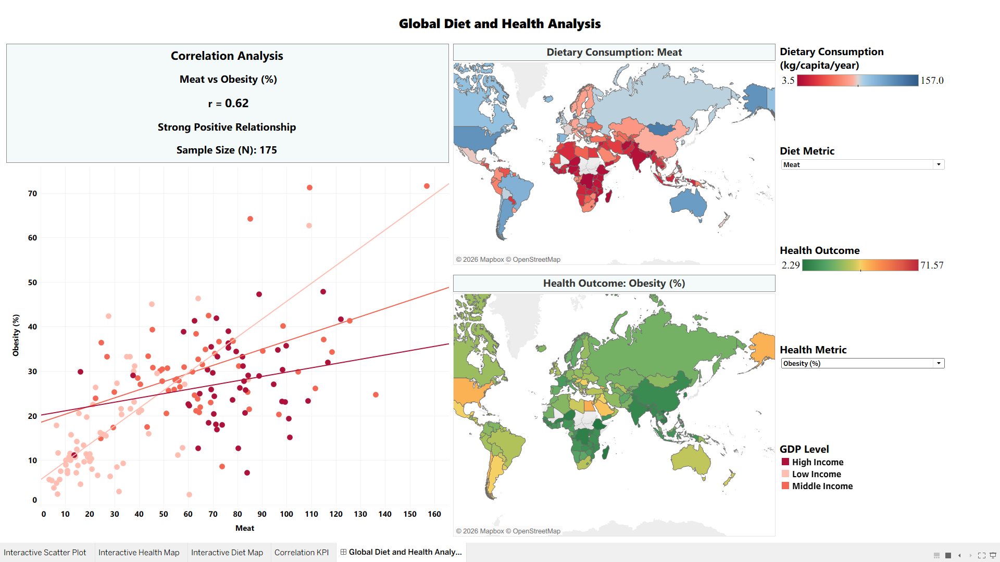

# Global Diet and Health Analysis

## What this project is about

I wanted to explore a simple question: Does what a country eats say anything about how healthy its people are? This project looks at dietary habits, like egg, milk, meat, sugar, fruit and vegetable consumption, across countries and compares them against health outcomes like life expectancy, obesity and diabetes prevalence.

The workflow of this project goes like: cleaning raw data from multiple public sources, merging it into a single country-level dataset, exploring it with Python and finally building an interactive Tableau dashboard so anyone can dig into the patterns themselves instead of just reading a static report.

## Data sources

Everything is pulled from public datasets and merged on a country-code basis:

* FAOSTAT:  food consumption by category (kg/capita/year)
* World Bank Open Data: GDP per capita (US$)
* Our World in Data: life expectancy (years), obesity rates (%) and diabetes prevalence (%)

## Tools used

* Python (Pandas, NumPy) and Jupyter Notebook for cleaning, merging and exploratory analysis of the data
* Tableau Public for creating the interactive dashboard

## Key insights

A few things stood out once the data was cleaned and correlated:

* Countries with higher GDP per capita tend to have longer life expectancy (r = 0.68), which is the strongest single pattern in the whole dataset. Wealthier countries usually have better lifestyle, healthcare, sanitation and food security, so it's hard to untangle diet from money.
* Eggs and milk stood out the most among the food groups. Both had a strong link to life expectancy (r = 0.67 and r = 0.64). Countries that eat more of these tend to live longer, though this is likely tangled up with wealth too, since these are foods that become more affordable as income rises.
* Meat consumption was interesting because it cuts both ways, it's linked to both higher life expectancy (r = 0.58) and higher obesity (r = 0.62). So more meat doesn't come with a clear health benefit.
* Sugar was the most surprising. It has a moderate link to obesity (r = 0.44) but a very weak relationship with diabetes (r = 0.08). Usually sugar and diabetes are assumed to be closely tied but data shows a different story. This indicates diabetes is driven by a lot more factors than just diet.
* Obesity and diabetes were moderately correlated with each other (r = 0.58).

## Dashboard

The interactive Tableau dashboard allows users to explore how different dietary variables relate to life expectancy, obesity and diabetes prevalence.
In this users can:
* compare countries
* switch between diet variables
* change health outcomes
* view correlation values
* explore global patterns through interactive maps



## Explore it live [Here](https://public.tableau.com/app/profile/chinmoyee.bhuyan4922/viz/GlobalDietandHealthAnalysis/GlobalDietandHealthAnalysisDashboard)

## How the project is organized

```text
global-diet-health-analysis/
│
├── data/
│   ├── raw/
│   └── processed/
│
├── notebooks/
│   ├── 001-data-cleaning.ipynb
│   ├── 002-data-merging.ipynb
│   └── 003-exploratory-data-analysis.ipynb
│
├── tableau/
│   ├── Global_Diet_and_Health_Analysis.twbx
│   ├── Dashboard.png
│   ├── Interactive Diet Map.png
│   ├── Interactive Health Map.png
│   ├── Interactive Scatter Plot.png
│   └── Correlation KPI.png
│
├── README.md
└── requirements.txt
```
## Why I built this 

This is my first big project built from scratch and I wanted it to be something I actually cared about. I'm a huge foodie, so I knew I wanted to do something related to food. After thinking for a while, the idea clicked: What if I looked at how dietary patterns differ from country to country and whether that connects to how healthy people actually are? Once I had that question, the rest of the project naturally came together, from collecting and cleaning the data to analyzing it and finally building the interactive dashboard to uncover the answers.

## About me

My name is Chinmoyee Bhuyan and these are the links to my:

* GitHub: https://github.com/chinmoyeedata
* LinkedIn: https://www.linkedin.com/in/chinmoyee-bhuyan/

Note: The notebooks use local file paths and were built on Windows. To re-run them in your device, update the paths in each notebook.

